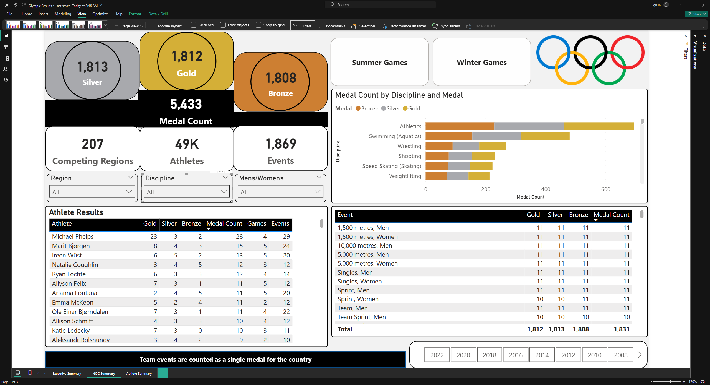

## Olympics - Power BI
This is a sample Power BI dashboard focusing on the Olympic Games.

**Concept:**\
One of the biggest design elements is the podium styled cards on the upper left corned.  Meant to resemble the podiums from the awards ceremony we have the total Gold, Silver, and Bronze medals awarded.  To avoid wasted space the Total Medal count was added to the center of the podium.\
The three cards below change on each page to focus on more revelant stats.

The Games slicer at the top allows users to switch between Summer and Winter Games while the year slicer at the bottom lets them select one or multiple years.\
Region and NOC are effectively the region name and the 3 character aggrebviation for it.\
Nation Olmpic committee (NOC) are the 206 regions recognized by the Internatinal Olympic Committee (IOC)\

**Executive Summary:**
*Whos it's for: This page is meant to show a high level view of the games.  By utilizing the Games and Years slicer you can narrow it down to a specific Games or individual years.  You can see the Top 10 Athletes overall, or click on an individual NOC to see the Top 10 for that Region.*\
\
-The three cards under the podium highlight the amount of competing regions, number of athletes and the number of events.\
-The stacked column chart on the upper right highlights the top 10 countries based on the filtered criteria.  Each level represents the amount of Bronze, Silver, and Gold medals awarded.  It's worth noting medals awards for team events are counted as one in this context.\
-The NOC by Medals table highlights the total awarded medals by country as well as the amount of atheletes representing them.\
-The Top 10 Atheletes by Medals table highlights the Top atheletes based on their total medal count.  Clicking on an individual NOC from the previously mentioned visual will highlight the Top 10 from the NOC only.\
-The Medal Counts map highlight each Country competing with the saturation based on the % of the total medals won.\

**NOC Summary:**
*Who it's for: This page is meant for the people who want to zone in on their Region overall.*\
-There are three additional slicers on this page located just below the podium section.  The first is for the Region.  While this is mostly made up of specific countries, not all Regions are made up of a single country.  The second slicer is Discpline.  This is the overall grouping for each events (i.e. 100 metres Backstroke and 100 metres Butterfly both fall under Swimming).\
-The stacked bar chart on the upper right focuses on the Disciple of the events (i.e. Speed Skating, Swimming, Bobsled).  Similar to the previous stached charts each section represents the amount of   Bronze, Silver, and Gold medals awarded.  This section not only highlights the biggest Disciplines overall, but when drilled down to a specific country it shows where they excell.\
-The Athlete Results section lists each athlete, the amount of medals won as well as the amount of Olympic games and events they competed in.\
-The Events visual in the lower right breaks down the medals by the individual events.\
-As previously noted, medals awarded for team events count as one for the Region/NOC, but individually for the athletes.\

**Athlete Results:**
*Who it's for: This page is similar to the NOC Summary, but breaks down the individual Athletes Overall stats.*\
-The three cards under the podium represent the won Medal percentage versus the amount of events the competed in, while the second two cards highlight the amount of Olympic games and events they competed in.  Please note due to ties, the overall Medal % can exceed 100%.\
-The Region slicer remains, however the Discipline and Mens/Womens slicers have been replaced with a Athlete search slicer.\
-The Athlete Results and Event sections mirror the NOC Summary page.\
-The Events by Year stacked column chart highlights which year/s the Athlete competed in as well at the amount of events broken down by their results.\

**Color Hex Codes:**
| Color  | Hex     |
| -------| --------| 
| Silver | #A8A9AD |
| Bronze | #CD7F32 |
| Blue   | #0078D0 |
| Yellow | #FFB114 |
| Black  | #000000 |
| Green  | #00A651 |
| Red    | #F0282D |